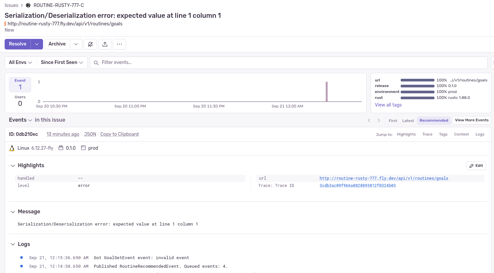
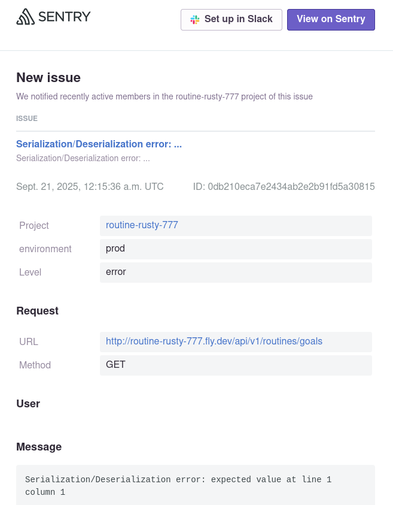
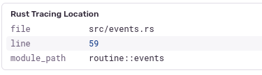
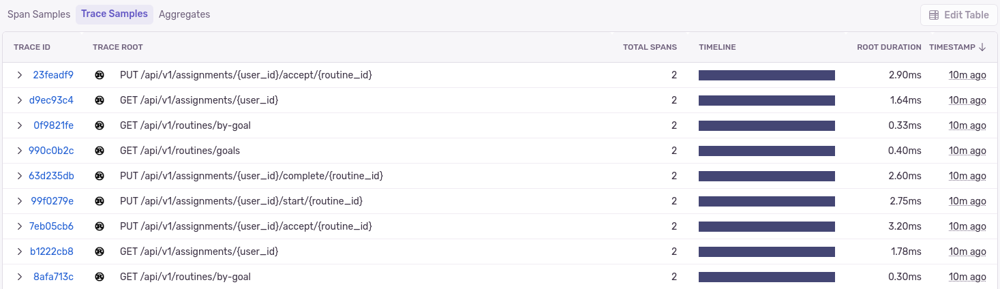
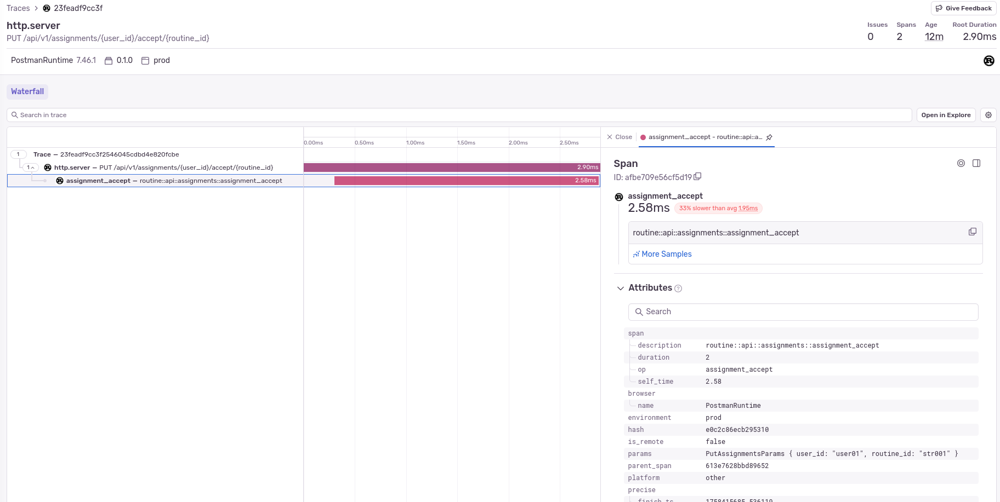
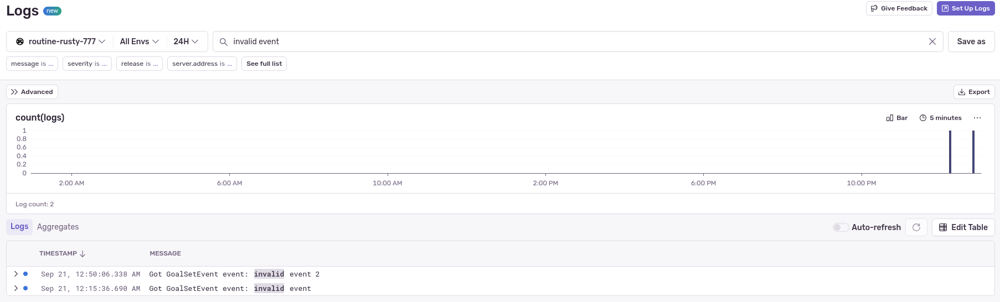
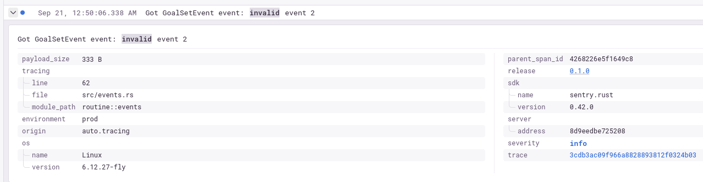
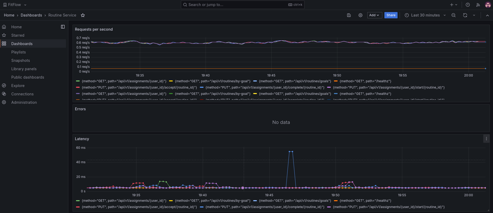

# Observability

## Overview

Observability is achieved using the following systems, which also require proper configuration and practices in the codebase.

### Error Monitoring, Tracing & Log aggregation
- **Sentry.io**
  - Error monitoring and alerts
  - Distributed tracing
  - Centralized Log aggregation

### Metrics & Dashboards
- **Grafana + Prometheus**
  - Metrics-based service health dashboard
  - Real-time performance monitoring

## Error Monitoring

I purposefuly sent an event with an invalid format to trigger an error in the system so we can see how this error monitoring system works.



I also got an email for the same error.



We can even see where the error ocurred in the code using the tracing data.



## Distributed tracing

We can see a sample of all traces being captured in the system.



And if we go into a specific trace, we can see more details about it.



## Log aggregation

Logs are also published and searchable in *Sentry.io*.

For example, we can seach for the logs of the invalid events we sent earlier to test the error monitoring.



And each log line includes more contextual information.



## Metrics & Dashboards

The service is publishing prometheus metrics, and *fly.io* supports reading this metrics and provides a Grafana instance so users can create dashboards based on these metrics.

- `fly.toml` metrics configuration:
   ```toml
   [metrics]
   port = 8081
   path = "/metrics"
   ```

With the metrics published by this service, I created this custom dashboard to monitor its health.


