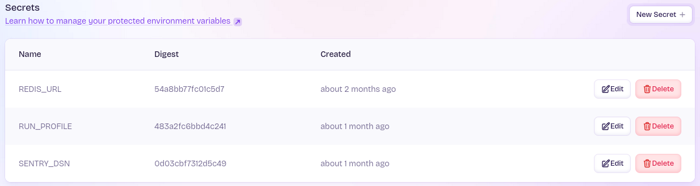

# Security

## Overview

As part of the security of the platform, *fly.io* provides a several security features out of the box, which we are taking advantage of.

- Secrets Management
- TLS (HTTPS) and automatic certificate management.

## Secrets Management

*fly.io* supports managing secrets out of the box, and it will make your secrets available to your service though environment variables.

# TLS (HTTPS) and automatic certificate management

*fly.io* will automatically add TLS to your service, and automatically manage certificates, even if internally the service only exposes plain HTTP.
